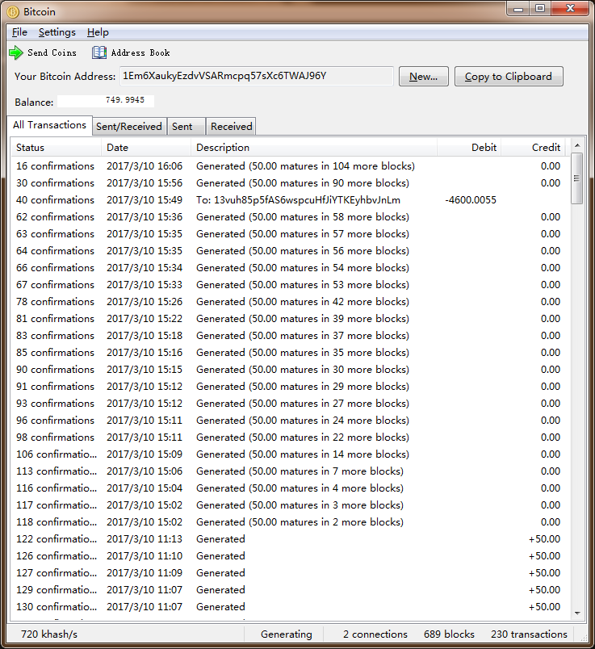

# 如何山寨比特币
这个项目基于[bitcoin v0.3.24](https://github.com/bitcoin/bitcoin/releases/tag/v0.3.24)，通过修改源码中的参数，建立一个独立的对等网络，与原本的比特币互不兼容。

选择这个release作为开发起点的原因：

- v0.2.7 增加命令行模式bitcoind
- v0.3.21 加入UPNP网络协议

以上两个功能在实验环境中需要，所以选择v0.3的最后一个release v0.3.24.

## 开发环境
需要两个以上节点，节点通过IP直接连接来初始化分布式网络。

可以两个节点在同一内网；或者一内网一公网，内网节点通过IP连接外网节点。

我的编译环境：

- Win7 64bit: mingw32 GNU Make 3.82
- Ubuntu 16.10: gcc 6.2.0

## 依赖关系
### Windows的依赖
参考编译文档[doc/build-msw.txt](https://github.com/ccen/bitcoinL/blob/v1.0/doc/build-msw.txt)

下载安装：

- tdm-gcc-4.5.1  **务必安装32位版本，即MinGW32**
- MSYS 1.0.11

下载编译：

- boost_1_43_0
- db-4.7.25.NC
- openssl-1.0.0d
- wxWidgets-2.9.1
- upnpc-exe-win32-20110215 *（可选）*

修改[src/makefile.mingw](https://github.com/ccen/bitcoinL/commit/8195b9b3a19f0c50d0b8eadb495e9bb0320befa8)，改变依赖库的绝对路径，尝试编译：
> mingw32-make bitcoin.exe bitcoind.exe -f makefile.mingw

编译成功后，开始下一步修改网络参数。

### Ubuntu的依赖
我在Ubuntu 16.10环境下只编译了命令行形式的bitcoind，没有编译图形化界面bitcoin，原因是这个release依赖的wxWidgets 2.9.0与gcc 6.2兼容性差。

参考编译文档[doc/build-unix.txt](https://github.com/ccen/bitcoinL/blob/v1.0/doc/build-unix.txt)

下载编译：

- boost_1_57_0
- db-4.7.25.NC
- miniupnpc-1.5 *（可选）*

修改[src/makefile.unix](https://github.com/ccen/bitcoinL/commit/faa70ca42239e2f11b7dd2efafbc505a638f2acc)，添加编译参数`-std=c++03 -fpermissive`，改变库的路径，尝试编译bitcoind：
> make -f makefile.unix bitcoind

编译成功后，开始下一步修改网络参数。

## 必须的修改
- 删除hard coding的[checkpoint](https://github.com/ccen/bitcoinL/commit/497ba11977a7a62820aa08f8cd284f61fc91604f#commitcomment-21573593)
- 改写hard coding的区块高度[nTotalBlocksEstimate](https://github.com/ccen/bitcoinL/commit/246266d0d608e9dea5af656930b8ceb864981997#commitcomment-21573531)
- 删除种子节点[pnSeed](https://github.com/ccen/bitcoinL/commit/497ba11977a7a62820aa08f8cd284f61fc91604f#commitcomment-21573607)
- 跳过[IRC连接](https://github.com/ccen/bitcoinL/commit/497ba11977a7a62820aa08f8cd284f61fc91604f#commitcomment-21573625)
- 跳过[DNSSeed发现](https://github.com/ccen/bitcoinL/commit/497ba11977a7a62820aa08f8cd284f61fc91604f#commitcomment-21573666)
- 改变最小挖矿难度限制 [bnProofOfWorkLimit](https://github.com/ccen/bitcoinL/commit/1ee7c474c38d79cac75dcedb52faf64aae671a88)
- 改变预期区块产生时间、难度调整周期[nTarget](https://github.com/ccen/bitcoinL/commit/633d24d76522dea84583906a57722bcc497f9651#diff-7ec3c68a81efff79b6ca22ac1f1eabba)

## 可选的修改
- 改变创世区块 *（这个好复杂.. 先跳过）*
- 改变网络端口
- 限制挖矿CPU核数[fLimitProcessors](https://github.com/ccen/bitcoinL/commit/ecb8d67830e349dc4e937d0f293666390c42388b#diff-7ec3c68a81efff79b6ca22ac1f1eabba)

## 运行
假设Ubuntu的ip是1.2.3.4，先启动Ubuntu的bitcoind，然后启动Win7的bitcoin客户端连接Ubuntu节点。

1.在Ubuntu上设置rpcpassword
> mkdir -p ~/.bitcoin && echo rpcpassword=*** > ~/.bitcoin/bitcoin.conf

2.在Ubuntu运行bitcoind
> ./bitcoind -gen

3.在Win7打开cmd.exe，运行客户端
	
> bitcoin.exe -gen -addnode=1.2.3.4

区块数据文件默认保存在：

- Win: %APPDATA%\Bitcoin
- Ubuntu: ~/.bitcoin

## 可能出现的异常

- blkindex Error

	原因是新的节点还没生成高度1的区块即退出，删除区块数据目录下的blkindex.dat，重新启动程序即可。
